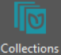
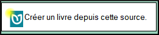
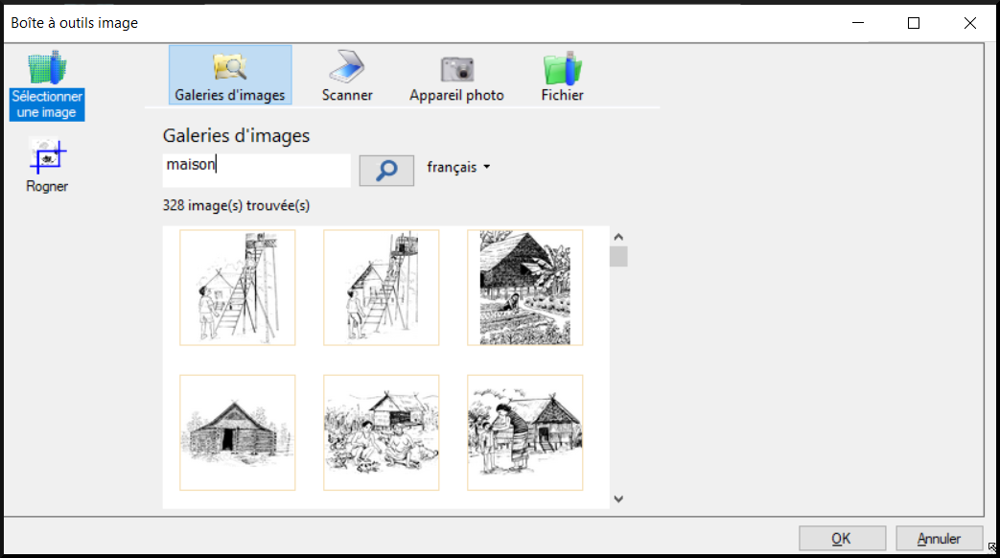
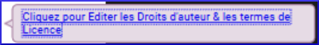
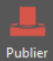
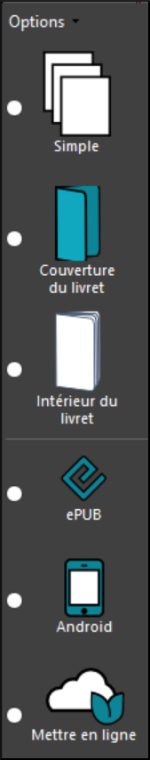
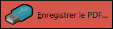

**Introduction**

This module explains how to create a simple book in a collection that has already been created.

**Where are we now?**

Before you can create a book in Bloom, the program must be installed on your computer and a collection must be created. If this has not been done, see Appendix X for instructions on installing Bloom and creating collections.

**Why is it important?**

Books in Bloom are stored in a collection. A collection can also contain templates to use when creating a new book. All books are created, edited and published in the same way. The simple book is the simplest type of book, so it is the best way to start learning Bloom.

**What will you do?**

- You start Bloom and use a vernacular collection.
- You will then create and edit a book from the Simple Book template.
- Once the editing is complete, you will publish the book as a PDF.

## 2.1 Starting Bloom

- Double click on the **Bloom** icon on the desktop

    OR

- (From the Start menu, choose Bloom)

    *When Bloom is first opened, your Collection will be empty*.

- 

    In the main window, under the **Collections** icon, you have the name of the collection and a list of all the books in that collection. You have several predefined templates in the Sources pane for new books.

## 2.2 [1] Choose Collection  

The first step is to make sure you have the right collection open. Most of your work will be done in the collection for your language. If necessary, you can change it now. See xxx for how to do this.

## 2.3 Creating a book based on Single Book

- In the **Sources for New Books** pane, click **Single Book**.

    

- Click on the **Create a book from this source** button.

    

    *Bloom adds a new book of this template to the book collection and opens it in the "Edit" tab. There are six pages already created.

    

    It opens on the **Outer cover** page. Note that the book appears in the **Edit** tab. The left pane is called Pages. It shows the pages that are in your book. The highlighted page in the **Pages** pane is displayed in the centre.

## 2.4 [2] Editing the Book

Now that the book has been created, you can edit it.

**Edit book - cover**

Edit the cover as follows:

- Make sure the cover page is displayed.
- If necessary, click on the page on the left. br
- The top text box should contain the title of the book.
- Type the title in language.
- Click on the **Change Image** icon in the image frame

    

- Click on **Image galleries**.

    

- To search for an image, type a word and press **Enter**.

    

    *The images found are displayed*.

- Select an image.
- Click on **OK**.
- Change the title page as desired.

    For details, see [3.4 pictures](03-More-information#3.4).

**Edit the book - add a page

- Click on the previous page icon. (i.e. where you want to place the new page).
- Click on "**+ Add Page**".

    

    *The **Add Page** dialog box* appears, displaying the templates you can use to add more pages to your book.

    

- Select **Basic Text & Illustration**.
- Click on **Add a page**.

    *The new page is displayed.

**Éditer le livre — ajouter une image**

-   Cliquez sur l’icône **Changer d'image** dans le cadre de l’image

    

-   Cliquez sur **Galeries d'images.**

    

-   Pour rechercher une image, tapez un mot (p.e. maison) et appuyez **Enter**

    

    *Les resultats sont affichés*

-   Cliquez sur une image
-   Cliquez sur **OK**.

    Pour plus de détails, voir [3.4](#sImages).

**Éditer le livre — ajouter le texte**

-   Cliquez sur le zone de texte.
-   Saisissez le texte.

    Pour plus de détails, voir [3.3](#sText).

**Éditer le livre — page de droits d'auteur**

-   Cliquez sur la page de crédits (à gauche).

    

    *La page de crédits s'affiche.*

-   Cliquez sur le lien bleu

    

-   Tapez les informations sur les droits d'auteur.

    

-   Choisissez le licence, par exemple BY-NC-SA

    

-   Cliquez sur **OK**.

## 2.5 [3] Publier un livre

Maintenant, nous sommes prêts à publier ce livre en créant un fichier PDF qui peut être pris à une imprimante pour l’impression.

**Publier le livre — PDF**

-   Cliquez sur le bouton **Publier** dans barre en haut à gauche

    

-   Cliquez sur le mot **Options** pour vérifiez la taille du papier
-   *Si la taille du papier est différente que la taille du livre, choisissez la taille du papier*.
-   Choisissez l’une des six options (à gauche)

    

    *Le livre s'affiche au centre*.

    Astuce: Tout d'abord, choisissez "**Simple" pour lire le livre une page à la fois dans l'ordre. Choisissez ensuite "Inside Booklet".**

**Publier le livre — Vérifier et faire les corrections**

-   Vérifiez le livre.
-   Si vous trouvez des erreurs, cliquez sur l'onglet **Éditer** et faites les corrections.

    Astuce: Choisissez "Simple" pour lire le livre une page à la fois en ordre. Puis choisissez Intérieur du livret

**Publier le livre — Publier encore**

-   Cliquez sur l’onglet **Publier**.

    

-   Choisissez encore l'option désirée (tout d'abord simple).
-   Vérifiez le livre encore.
-   Quand le livre est correct,
-   Enregistrer le PDF (voir dessus).

**Publier le livre — Enregistre le PDF**

-   Cliquez sur Enregistrer le PDF sur la barre d'outils

     .

-   Confirmez le nom de fichier et le dossier.
-   Cliquez sur **Enregistrer**.
-   Si nécessaire, recommencez pour une autre option. (p.ex. la couverture ou l'intérieur)
-   Accédez au dossier où vous avez enregistré le fichier PDF.

**Publier le livre — Imprimer le PDF**

Si vous avez une imprimante connectée, vous pouvez imprimer le livre directement sur votre imprimante

-   Si nécessaire, cliquez sur l’onglet **Publier**.

    

-   Choisissez l’une des six options (à gauche).
-   Cliquez sur Imprimer.

    

    *Un message s’affiche*

    

-   Après avoir lu le message, cliquez sur **OK** pour fermer le message.

    *Suivant les instructions. C.-à-d. imprimer taille (pas livret) en paysage sur papier A4.*

-   Si nécessaire, répétez pour l'option suivante.

Edit book - add image** Click on the **Change Image** icon in the image frame.

- Click on the **Change Image** icon in the image frame

    

- Click on **Image galleries**.

    

- To search for an image, type in a word (e.g. house) and press **Enter**.

    

    *Results are displayed*

- Click on an image
- Click on **OK**.

    For details, see [3.4 pictures](03-More-information#3.4).

**Edit book - add text

- Click on the text box.
- Enter the text.

    For details see [3.3 text](03-More-information#3.3).

**Edit Book - Copyright Page** Click on the credits page (at the bottom of the page).

- Click on the credits page (left).

    

    *The credits page appears.

- Click on the blue link

    

- Type in the copyright information.

    

- Choose the license, for example BY-NC-SA

    

- Click **OK**.

## 2.5 [3] Publish a book

Now we are ready to publish this book by creating a PDF file that can be taken to a printer for printing.

Publish Book - PDF** Click on the **Publish Book - PDF** button.

- Click on the **Publish** button in the top left bar

    

- Click on the word **Options** to check the paper size
- If the paper size is different from the book size, choose the paper size*.
- Choose one of the six options (left)

    

    *The book is displayed in the centre*.

    Tip: First, choose "**Simple" to read the book one page at a time in order. Then choose "Inside Booklet".

**Publish Book - Check and Make Corrections

- Check the book.
- If you find any errors, click on the **Edit** tab and make corrections.

    Tip: Choose "Simple" to read the book one page at a time in order. Then choose Inside the Booklet

**Publish Book - Publish Again

- Click on the **Publish** tab.

    

- Choose the desired option again (simple at first).
- Check the book again.
- When the book is correct,
- Save the PDF (see above).

**Publish book - Save PDF**.

- Click on Save PDF on the toolbar

     .

- Confirm the file name and folder.
- Click **Save**.
- If necessary, repeat for another option. (e.g. cover or interior)
- Go to the folder where you saved the PDF file.

**Publish the book - Print the PDF

If you have a printer connected, you can print the book directly on your printer

- If necessary, click on the **Publish** tab.

    

- Choose one of the six options (on the left).
- Click on Print.

    

    *A message is displayed*.

    

- After reading the message, click **OK** to close the message.

    *Follow the instructions. I.e. print size (not booklet) in landscape on A4 paper.

- If necessary, repeat for the next option.

