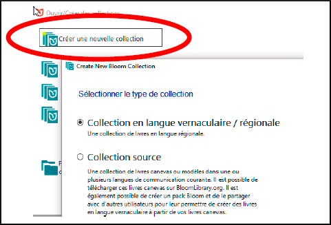
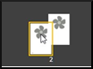
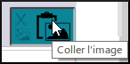

---
title: 3 More information
---
This chapter contains more information about creating collections and editing pages.

## 3.1 The collection{#3.1}

For most of your work, you would use the collection for your language. But there are times when you will want to either switch to another collection or create a new one.

**To create a collection**

- 1\. Click the **Other collection.** button 

    *The Open/Create Collections dialog box opens.

- 2\. Click on **Create a new collection**.

    .

    *The Create New Bloom Collection dialog box appears.

- 3\. Click on **Plenacular/Regional Language Collection**.
- 4\. Click **Next**.
- 5\. Select the primary language for this collection. (e.g. French) and then click **Next**.
- 6\. Enter the country (Chad), then click **Next**.
- 7\. Choose the font (Andika) and click **Next**.
- 8\. Enter the project name and click **Next**.
- 9\. Click on Finish.

    *The main window appears.

    At the top of the window, the name of your new collection and the Bloom version number are displayed. Now you are ready to add a book to your collection.

**Choose another collection** From the main window

- From the main window:
- Click on **Other Collection**.

    *The Open/Create Collection dialog box appears.

    

- If your collection is in the list,
- Click on the name of the collection. [1]

    *The main window reappears*.

- If your collection is not in the list,
- Click on "Search for another collection on this computer" [2] *A list of folders will appear

    *A list of folders will appear*

- Double-click on the folder with the project name
- Double-click on the file with the project name.bloomCollection

    *The main window reappears*.

## 3.2 The page{#3.2}

**Rearrange the pages of the book**.

- Drag and drop the icons in the "Pages" pane.

    

**Deleting a Page from a Book*** Right-click on the page in the Book pane.

- Right click on the page in the "Pages" pane.
- Choose **Remove Page**. OR
- Click on the img icon (img/50cdc75140348225eb90e141b7e0eef4.png) at the bottom of the pages.

    *The page is deleted*.

## 3.3 Text{#3.3}

**Edit the book - format the text**.

- Format the text by clicking on the grey command icon 

    

    *The **Format** dialog box is displayed.

- Choose the **style** of the text box [1].
- Click on the **Characters** tab [2].

    

- Choose the formatting of the style (e.g. font size 18) [3]
- Click on the **Paragraph** tab [4]
- Choose any other formatting you wish.
- Click on any other part of the page to close the box. *The box is closed*.

## 3.4 Pictures{#3.4}

**Add (change) a picture** [5] Click on the "Add (change) a picture" icon.

- Click on the "**Change Image**" icon.

    

    

- Click on **Image galleries**.
- To search for an image, type a word and press **Enter**.
- Select an image.
- Click **OK**.

**Paste an image

- Copy an image to a program other than Bloom and return to Bloom.
- Click on the **Paste Image** icon in the image frame.

    

    *The image is displayed*.

**Add license information for all images**.

- Display a page with the image.
- Click on the question mark of one of the images

    

- Fill in the license information for the image.
- Click on **OK.**

    *Bloom may ask you if you want to copy this data to all other images in the book*.

- Click on **Yes** .

