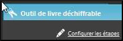

---
title: 8 Decodable book
---

**Introduction**

In this module we will learn how to create a decipherable book in Bloom (i.e. a book that contains only the learned letters (or sight words).

**Why is this important?**

When people start learning to read, they need a lot of practice with reading material that contains only the letters (or sight words) they have learned so far. Without a program like Bloom, it is very difficult to ensure that your book is limited to known letters or sight words. Bloom's Decipherable book allows us to introduce letters and sight words at different stages. When you make decipherable books, Bloom will warn you whenever you use a word with letters that have not yet been learned (or that is not a sight word).

**What will you do?**

- Create a book based on the decipherable book template.
- Set the stages by adding the graphemes, word list and letter and sight word definitions for each stage.
- Create a level 1 decipherable book.

##8.1 Choose the collection

- If necessary, start Bloom
- Check that the correct collection is overte.
- If necessary, click **Other collections**.

    *The **Open / Create Collection** dialog box is displayed.

- Select the desired collection.

    *The main window reappears.

##8.2 Creating a Decipherable Book

- In the **Sources for New Books** pane, select the **Decipherable Book** template.
- Click **Create a book from this source**.

##8.3 Configure Steps Click on img(s) if necessary.

- If necessary, click  (on the right) to see the tools pane.
- In the **Decryptable Book Tool** pane, click **Set Up Steps**.

    

    *The dialogue box appears*. See below.

##8.4 Adding graphemes

- Click on the **Letters** tab.
- Type or paste the desired letters into the **Letters and Letter Sets** text box.

    img (img/fffa9eb702c6cba948c1c2f65c274cee.png)

##8.5 Adding a word list (suggested words)

- Click on the **Suggested Words** tab.
- Type or paste the suggested words into the text box **1) Type the words here**.
- Click on the Folder of sample texts link.

    *An Explorer window opens in the folder Bloom uses to get suggested words.

- Paste your text file into this folder.
- Close the Explorer window.

    *The full path name of the file is displayed in the text box* **2) Place the text files***.

