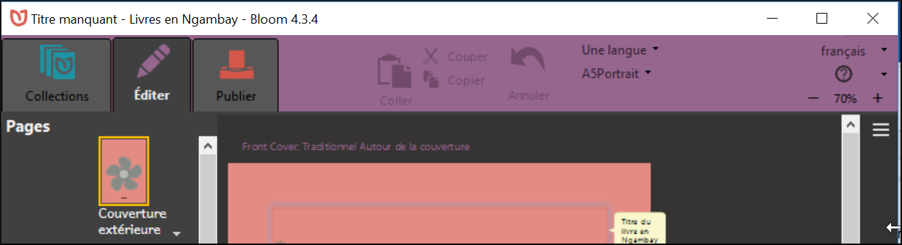
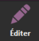
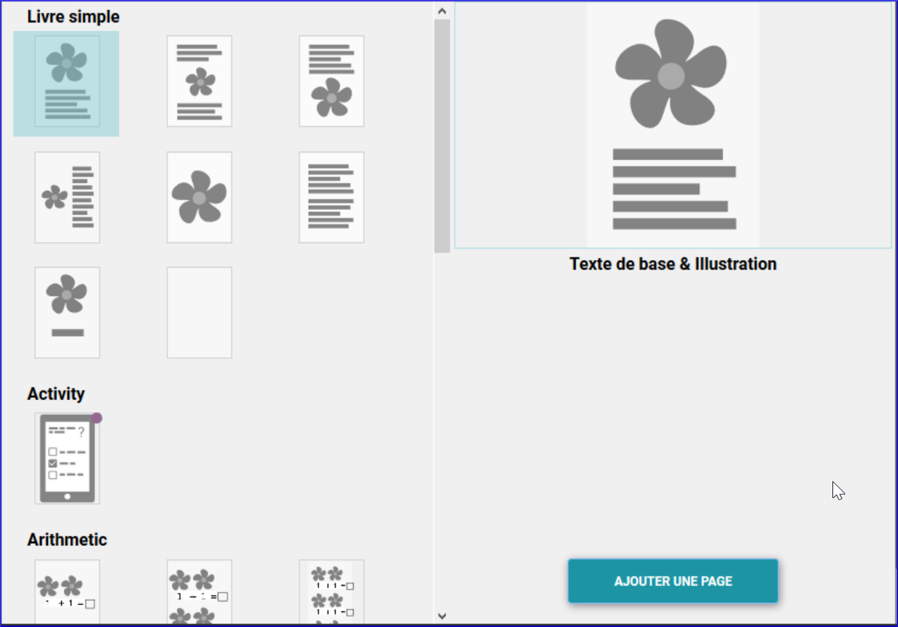
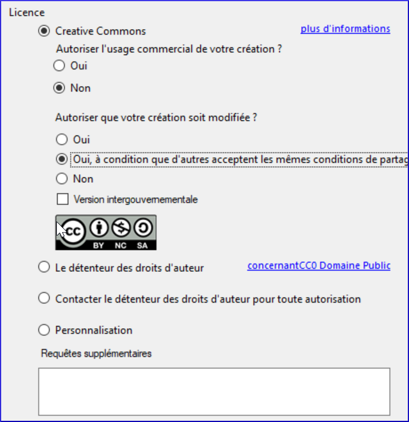
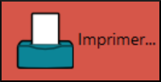

**Introduction**

Ce module explique comment créer un livre simple dans une collection qui a déjà été créée.

**Où en sommes-nous ?**

Avant de pouvoir créer un livre dans Bloom, le programme doit être installé sur votre ordinateur et une collection doit être créée. Sinon, voir annexe X pour comment faire.Si cela n'a pas été fait, consultez l'annexe X pour obtenir des instructions sur l'installation de Bloom et la création de collections.

**Pourquoi est-il important ?**

Les livres en Bloom sont stockés dans une collection. Une collection peut également contenir des modèles à utiliser lors de la création d'un nouveau livre. Tous les livres sont créés, édités et publiés de la même manière. Le livre simple est le type de livre le plus simple, c'est donc la meilleure façon de commencer à apprendre Bloom.

**Que ferez-vous ?**

-   Vous démarrez Bloom et utilisez une collection vernaculaire.
-   Vous allez ensuite créer et éditer un livre à partir du modèle Livre simple.
-   Une fois l’édition terminée, vous publierez le livre en format PDF.

**2.1 Démarrer Bloom**

-   Double-cliquez sur l’icône **Bloom** sur le bureau

    OU

-   (Dans le menu Démarrer, choisissez Bloom)

    *Lorsque Bloom est ouvert pour la première fois, votre Collection sera vide.*

-   

    Dans la fenêtre principale, sous l’icône **Collections**, vous avez le nom de la collection ainsi qu’une liste de tous les livres de cette collection. Vous avez plusieurs modèles prédéfinis dans le volet Sources pour nouveaux livres.

**2.2 [1] Choisir la collection**

La première étape est de s'assurer que vous avez la bonne collection ouverte. La plupart de votre travail sera fait dans la collection pour votre langue. Si nécessaire, vous pouvez la modifier maintenant. Voir xxx pour savoir comment faire.

**2.3 Créer un livre basé sur Livre simple**

-   Dans le volet **Sources pour nouveaux livres**, cliquez sur **Livre simple**

    

-   Cliquez sur le bouton **Créer un livre depuis cette source**.

    

    *Bloom ajoute un nouveau livre de ce modèle à la collection de livres et l’ouvre dans l’onglet « Éditer ». Il y a six pages déjà créées.*

    

    Elle s’ouvre sur la page **Couverture extérieure**. Notez que le livre apparaît dans l’onglet **Éditer**. Le volet gauche est appelé Pages. Il montre les pages qui sont dans votre livre. La page en surbrillance dans le volet **Pages** s’affiche au centre.

**2.4 [2] Éditer le livre**

Maintenant que le livre a été créé, vous pouvez l'éditer.

**Éditer le livre — couverture**

Éditez la couverture de la manière suivante :

-   Assurez que la page de couverture est affichée.
-   Si necessaire, cliquez sur la page à gauche. br
-   *La zone de texte supérieure doit contenir le titre du livre.*
-   Tapez le titre en langue.
-   Cliquez sur l’icône **Changer d’image** dans le cadre de l’image

    

-   Cliquez sur **Galeries d'images.**

    

-   Pour rechercher une image, tapez un mot et appuyez **Enter**

    

    *Les images trouvé sont affichés*

-   Sélectionnez une image.
-   Cliquez sur **OK**.
-   Modifier la page de titre comme désiré.

    Pour plus de détails, voir [3.4](#sImages).

**Éditer le livre — ajouter une page**

-   Cliquez sur l’icône de la page précédente. (C.à.d. où vous voulez placer la nouvelle page.)
-   Cliquez sur « **+ Ajouter une page** »

    

    *La boîte de dialogue* **Ajouter une page** *s’affiche et affiche les modèles que vous pouvez utiliser pour ajouter d’autres pages à votre livre.*

    

-   Sélectionnez **Texte de base & Illustration**.
-   Cliquez sur **Ajouter une page**.

    *La nouvelle page s’affiche*.

**Éditer le livre — ajouter une image**

-   Cliquez sur l’icône **Changer d'image** dans le cadre de l’image

    

-   Cliquez sur **Galeries d'images.**

    

-   Pour rechercher une image, tapez un mot (p.e. maison) et appuyez **Enter**

    

    *Les resultats sont affichés*

-   Cliquez sur une image
-   Cliquez sur **OK**.

    Pour plus de détails, voir [3.4](#sImages).

**Éditer le livre — ajouter le texte**

-   Cliquez sur le zone de texte.
-   Saisissez le texte.

    Pour plus de détails, voir [3.3](#sText).

**Éditer le livre — page de droits d'auteur**

-   Cliquez sur la page de crédits (à gauche).

    

    *La page de crédits s'affiche.*

-   Cliquez sur le lien bleu

    

-   Tapez les informations sur les droits d'auteur.

    

-   Choisissez le licence, par exemple BY-NC-SA

    

-   Cliquez sur **OK**.

**2.5 [3] Publier un livre**

Maintenant, nous sommes prêts à publier ce livre en créant un fichier PDF qui peut être pris à une imprimante pour l’impression.

**Publier le livre — PDF**

-   Cliquez sur le bouton **Publier** dans barre en haut à gauche

    

-   Cliquez sur le mot **Options** pour vérifiez la taille du papier
-   *Si la taille du papier est différente que la taille du livre, choisissez la taille du papier*.
-   Choisissez l’une des six options (à gauche)

    

    *Le livre s'affiche au centre*.

    Astuce: Tout d'abord, choisissez "**Simple" pour lire le livre une page à la fois dans l'ordre. Choisissez ensuite "Inside Booklet".**

**Publier le livre — Vérifier et faire les corrections**

-   Vérifiez le livre.
-   Si vous trouvez des erreurs, cliquez sur l'onglet **Éditer** et faites les corrections.

    Astuce: Choisissez "Simple" pour lire le livre une page à la fois en ordre. Puis choisissez Intérieur du livret

**Publier le livre — Publier encore**

-   Cliquez sur l’onglet **Publier**.

    

-   Choisissez encore l'option désirée (tout d'abord simple).
-   Vérifiez le livre encore.
-   Quand le livre est correct,
-   Enregistrer le PDF (voir dessus).

**Publier le livre — Enregistre le PDF**

-   Cliquez sur Enregistrer le PDF sur la barre d'outils

     .

-   Confirmez le nom de fichier et le dossier.
-   Cliquez sur **Enregistrer**.
-   Si nécessaire, recommencez pour une autre option. (p.ex. la couverture ou l'intérieur)
-   Accédez au dossier où vous avez enregistré le fichier PDF.

**Publier le livre — Imprimer le PDF**

Si vous avez une imprimante connectée, vous pouvez imprimer le livre directement sur votre imprimante

-   Si nécessaire, cliquez sur l’onglet **Publier**.

    

-   Choisissez l’une des six options (à gauche).
-   Cliquez sur Imprimer.

    

    *Un message s’affiche*

    

-   Après avoir lu le message, cliquez sur **OK** pour fermer le message.

    *Suivant les instructions. C.-à-d. imprimer taille (pas livret) en paysage sur papier A4.*

-   Si nécessaire, répétez pour l'option suivante.
