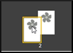
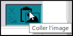

Ce chapitre contient plus d'informations sur la création de collections et l'édition de pages.

### 3.1 La collection{#3.1}

Pour la plupart de votre travail, vous utiliseriez la collection pour votre langue. Mais il y a des moments où vous voudrez soit passer à une autre collection, soit en créer une nouvelle.

**Pour créer une collection**

-   1\. Cliquez sur le bouton **Autre collection.** 

    *La boîte de dialogue Ouvrir / créer des collections s’ouvre*

-   2\. Cliquez sur **Créer une nouvelle collection**

    .

    *La boîte de dialogue Créer une nouvelle collection Bloom) s’affiche.*

-   3\. Cliquez sur **Collection en langue vernaculaire/régionale**.
-   4\. Cliquez sur **Suivant**.
-   5\. Sélectionnez la langue principale de cette collection. (p.ex. français) puis cliquez sur **Suivant**.
-   6\. Entrez le pays (Tchad), puis cliquez sur **Suivant**.
-   7\. Choisissez la police (Andika) et cliquez sur **Suivant**.
-   8\. Saisissez le nom du projet et cliquez sur **Suivant**.
-   9\. Cliquez sur **Terminer**.

    *La fenêtre principale s’affiche.*

    En haut de la fenêtre, le nom de votre nouvelle collection et le numéro de version de Bloom s’affichent. Maintenant, vous êtes prêt à ajouter un livre à votre collection.

**Choisir une autre collection**

-   Depuis la fenêtre principale:
-   Cliquez sur **Autre collection**.

    *La boîte de dialogue Ouvrir/Créer une collection s’affiche.*

    

-   Si votre collection se trouve dans la liste,
-   Cliquez sur le nom de la collection. [1]

    *La fenêtre principale réapparaît*

-   Si votre collection n’est pas dans la liste,
-   Cliquez sur « Rechercher une autre collection sur cet ordinateur » [2]

    *Une liste des dossiers s’affiche*

-   Double-cliquez sur le dossier avec le nom du projet
-   Double-cliquez sur le fichier avec le nom du projet.bloomCollection

    *La fenêtre principale réapparaît*.

### 3.2 La page{#3.2}

**Réorganiser les pages du livre**

-   Faites glisser et déposez les icônes dans le volet « **Pages**».

    

**Supprimer une page d’un livre**

-   Faites un clic droit sur la page du volet « **Pages** ».
-   Choisissez **Retirer la page**. OU
-   Cliquez sur l’icône  en bas des pages.

    *La page est supprimée*.

### 3.3 Texte{#3.3}

**Éditer le livre — formater le texte**

-   Formatez le texte en cliquant sur l’icône de commande grise 

    

    *La boîte de dialogue* **Formater** *s'affiche.*

-   Choisissez le **style** de la boîte de texte [1].
-   Cliquez sur l’onglet **Caractères** [2]

    

-   Choisissez la mise en forme du style (p.ex. taille de police 18) [3]
-   Cliquez sur l’onglet **Paragraphe** [4]
-   Choisissez tout autre formatage désiré.
-   Cliquez sur n’importe quelle autre partie de la page pour fermer la boîte. *La boîte est fermée*.

### 3.4 Images{#3.4}

**Ajouter (changer) une image**

-   Cliquez sur l’icône «**Changer d’image**».

    

    

-   Cliquez sur **Galeries d’images**.
-   Pour rechercher une image, tapez un mot et appuyez **Enter**
-   Sélectionnez une image.
-   Cliquez sur **OK**.

**Coller une image**

-   Copiez une image dans un autre logiciel que Bloom et retournez à Bloom.
-   Cliquez sur l’icône **Coller l’image** dans le cadre de l’image.

    

    *L'image est affichée*. .

**Ajouter des informations de licence pour toutes les images**

-   Affichez une page avec l’image.
-   Cliquez sur le point d’interrogation de l’une des images

    

-   Remplir les informations de licence pour l’image.
-   Cliquez sur **OK.**

    *Bloom peut vous demande si vous voulez copier ces données sur toutes les autres images du livre*

-   Cliquez sur **Oui** (Yes) .
