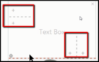

**Introduction**

Ce module explique comment.créer une page personnalisée dans un livre.

Regardez le vidéo **Bloom_custompage-SD.mp4**.

### 6.1 Commencer Bloom

-   *La fenêtre principale apparaît.*

### 6.2 Choisir une collection

-   Vérifiez que la bonne collection est ouverte.
-   Sinon, cliquez sur **Autres collections**.

    *La boîte de dialogue* **Ouvrir / Créer une collection** *s’affiche.*

-   Sélectionnez la collection désirée.

    *La fenêtre principale réapparaît*.

### 6.3 Créer un livre

-   Dans le volet **Sources pour nouveaux livres**, cliquez sur **Livre simple**.
-   Cliquez sur **Créer un livre depuis cette source**.
-   Dans la page **Couverture extérieur**, saisissez un titre.

### 6.4 Personnaliser une page – modifier la taille des champs

-   Vous pouvez modifier la taille des champs de texte et des images **en faisant glisser la ligne de séparation** entre eux.

    

### 6.5 Personnaliser une page – ajouter des champs

-   Cliquez droit sur le bouton **Modifier la mise en page**.

    

-   Utilisez les symboles **+** pour ajouter de nouveaux champs.

    

-   Indiquez à Bloom si vous désirez avoir une image ou un texte dans ce champ.

    

-   Cliquez à gauche sur le bouton Modifier la mise en page.

    

### 6.6 Créer une page Personnalisée

-   Pour créer une page personnalisée, cliquez sur **Ajouter une page**,
-   Sélectionnez **Personnalisation**,
-   Puis cliquez sur **Ajouter cette page**.

    *Une page personnalisée s’affiche et est prête à être modifiée*.

### 6.7 Définir la page

-   Utilisez les symboles **+** pour ajouter de nouveaux champs.
-   Cliquez sur **X** pour supprimer de champs.
-   Indiquez à Bloom si vous désirez avoir une image ou un texte dans ce champ.
-   Cliquez à gauche sur le bouton **Modifier la mise en page** pour la fixer
