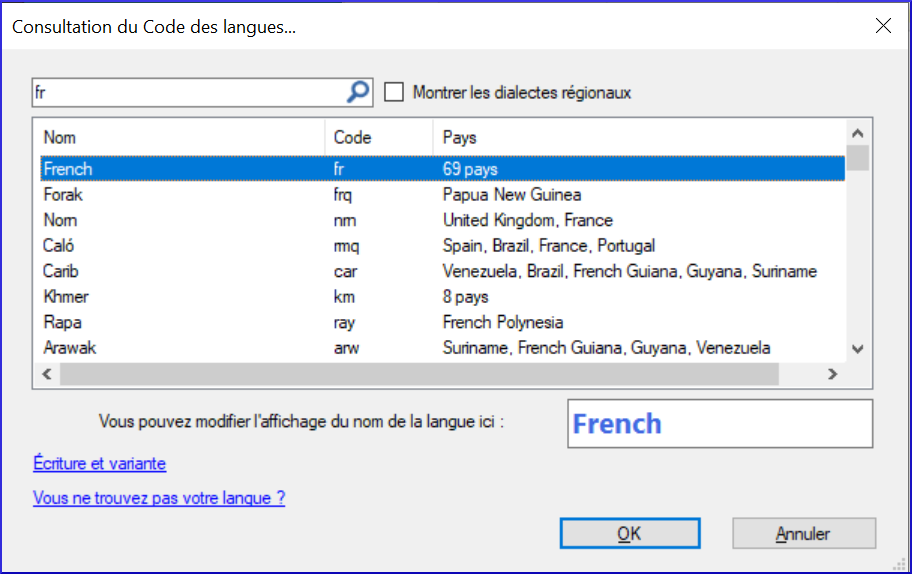
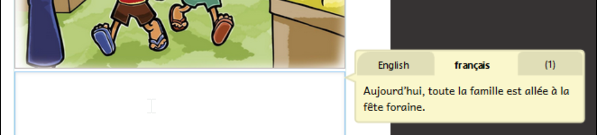

**Introduction**

Dans cette module, nous allons apprendre comment créer un livre canevas (en français) que les autres peuvent utiliser pour créer des livres en leur langues.

**Où en sommes-nous ?**

Vous avez déjà fait des livres dans une collection vernaculaire. Maintenant, nous allons apprendre à faire des livres dans une collection source. On peut partager ces livres avec d’autres pour les faire en leurs langues.

**Pourquoi est-ce important ?**

Dans Bloom, il existe deux types de collections. Une collection vernaculaire contient des livres pour une langue spécifique. Une collection source contient des livres dans une langue comme française. Puis les livres qui peuvent être partagés et traduits dans des langues vernaculaires.

Quand vous voulez créer un livre que d’autres peuvent traduire dans leur propre langue, il faut les créer dans une collection source afin qu’ils puissent être partagés avec un pack Bloom.

**Que ferez-vous ?**

-   Nous allons d’abord créer une nouvelle collection source puis créer un livre canevas.
-   Ensuite, nous ferons un pack Bloom pour cette collection qui peut être envoyée à d’autres pour créer des livres dans leur langue.

### 5.1 Créer une collection source

-   1\. Si nécessaire, lancez Bloom
-   2\. Cliquez sur le bouton  **Autre collection.**
-   3\. Cliquez sur **Créer une nouvelle collection**.
-   4\. Cliquez sur **Collection source**.
-   5\. Cliquez sur **Suivant**.
-   6\. Saisissez le nom du projet (p.ex. Mes livres canevas) et cliquez sur **Suivant**.
-   7\. Cliquez sur **Terminer**.

**Changer les langues**

Par défaut, Bloom règle la langue 1 et la langue 2 sur l'anglais. Vous devez changer les langues en français.

-   Depuis la fenêtre principale:
-   Cliquez sur **Paramètres**
-   Cliquez sur l'onglet **Langues**

    

-   Pour changez Langue 1 en FR
-   Cliquez sur le lien bleu **Modifier**

    

-   Tapez espace puis fr
-   Choisissez la langue French
-   Cliquez sur **OK**
-   répéter pour la deuxième langue (Langue 2 \> FR)

### 5.2 Créer un livre canevas

**Vérifier le pack de mise en page**

Si vous créez des livres A6, vous pouvez choisir "Mode économique pour le papier"

-   Depuis la fenêtre principale:
-   Cliquez sur **Paramètres**.
-   Cliquez sur l’onglet **Création de livre**
-   Réglez le pack de mise en page autour de la couverture à **Paper saver** (économiser de papier).
-   Cliquez sur **OK**

**Creér un livre**

Vous créez des livres sources de la même manière qu'auparavant.

-   Cliquez sur un modèle comme **Livre simple**.
-   Cliquez sur **Créer un livre depuis cette source**.

### 5.3 Compléter le livre comme désiré

-   Remplissez
-   la couverture
-   la page de titre
-   Ajouter les pages
-   Ajouter le texte
-   Changer les images
-   Remplissez la page de crédits.

### 5.4 Pack Bloom

Vous utilisez les packs Bloom pour partager des livres des collections sources avec d'autres utilisateurs. Avant de pouvoir utiliser un livre dans un pack Bloom, vous devez l'installer.

**Créer un pack Bloom**

-   Cliquez sur l’onglet **Collections**.
-   Dans la barre d’outils, cliquez sur **Créer un pack Bloom**.

    

-   Tapez un nom pour le fichier pack Bloom et cliquez sur **Enregistrer**.

    *Le pack Bloom est créé et prêt à être distribué*.

-   Fermez Bloom

**Installer un pack Bloom**

Avant de pouvoir utiliser un pack Bloom, vous devez l'installer.

-   Ouvrez une fenêtre **Explorer de fichiers** dans le dossier.
-   Double-cliquez sur le fichier du pack Bloom.

    *Bloom ajoutera la collection et affichera un message quand il aura terminé.*

-   Cliquez sur **OK** pour fermer le message.

    *Bloom va redémarrer.*

**Utilisez les livres canevas d’un pack Bloom**

-   Dans le volet **Source pour des nouveaux livres**, sélectionnez le livre désiré.
-   Sélectionnez **Créer un livre depuis cette source**.

    *Le livre est créé et chaque zone de texte montre le texte à traduire dans une bulle jaune.*

    

-   Cliquez sur le zone de texte
-   Traduisez le texte affiché dans le ballon dans votre langue.
