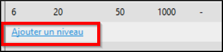
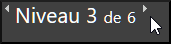

**Introduction**

Ce module explique comment créer les livres par niveau de difficulté dans Bloom.

**Pourquoi est-ce important ?**

Dans la prochaine session, nous allons créer des livres déchiffrables pour faciliter la lecture des débutants pendant qu’ils apprennent encore les lettres. Avec les livres par niveau, il n’y a aucune restriction sur les lettres utilisées, mais c’est la difficulté des livres qui est contrôlée. Le niveau de difficulté est défini par le nombre de pages, la longueur des phrases et le nombre de mots par phrase ou par page.

**Que ferez-vous ?**

-   Créer un livre simple ou un livre par niveau.
-   Configurer les niveaux.
-   Créer des livres aux niveaux divers.

### 7.1 Choisir la collection

-   Si nécessaire, cliquez sur **Autres collections**.

    *La boîte de dialogue* **Ouvrir / Créer une collection** *s’affiche*.

-   Sélectionnez la collection désirée.

    *La fenêtre principale réapparaît.*

### 7.2 Créer un livre

-   Dans le volet **Sources pour des nouveaux livres**, sélectionnez le modèle de **Livre par niveau**.
-   Cliquez sur **Créer un livre depuis cette source**.
-   Si nécessaire, cliquez l’icône de menu (à droite)

    *Le volet « Outil de livre par niveau » s’affiche.*

### 7.3 Configurer les niveaux

-   Dans le volet **Outil de livre gradué**, cliquez sur le lien **Configurer les niveaux**.

    

    *La boîte de dialogue «Configurer l’outil de livre par niveau» s’affiche.*

-   Sur le côté gauche, un tableau récapitulatif de niveau est donné. Sur le côté droit, nous pouvons voir les règles pour un niveau donné.

    

### 7.4 Configurer niveau 1

Maintenant nous voulons définir chaque niveau selon nos règles. Notez qu’il y a six niveaux définis préalablement. Nous voulons les modifier et ajouter des niveaux supplémentaires si nécessaire.

-   1\. Cliquez sur **Niveau 1**.
-   2\. Définissez les mots **maximums dans chaque phrase** (par exemple, 3).
-   3\. Définissez le mot **maximum dans chaque page** (par exemple, 3).
-   4\. Définissez le nombre **maximum de mots par livre** (par exemple, 20).
-   5\. Si vous le souhaitez, nous pourrions définir le **maximum de mots uniques par livre** (par exemple, 10).

### 7.5 Configurer les autres niveaux

-   Configurez les autres niveaux comme désiré.
-   Voilà quelques suggestions dans le tableau :
-   Définissez la limite de mots par phrase. [A]
-   Définissez la limite de mot par page. [B]
-   Définissez Nombre maximal de mots par livre. [C]
-   Si désiré, on peut définir la limite de mots uniques par livre. [D]

| **Niveau** | **[A]** | **[B]** | **[C]** | **[D]** |
|------------|---------|---------|---------|---------|
| **2**      | **5**   | **5**   | **48**  | **16**  |
| 3          | 7       | 10      | 72      | 24      |
| 4          | 8       | 18      | 206     | 40      |
| 5          | 12      | 25      | 500     | 72      |
| 6          | 20      | 50      | 1000    |         |
| 6          | 20      | 50      | 1000    |         |

### 7.6 Supprimer un niveau

-   1\. Cliquez sur le niveau
-   2\. Cliquez sur le lien **Retirer le niveau**.

    

### 7.7 Modifier l’ordre

-   Faites glisser les lignes pour changer l'ordre.

### 7.8 Ajouter un niveau

-   Cliquez sur le lien **Ajouter un niveau**.

    

    Si on ne veut pas qu’une règle s’applique à un niveau donné, décocher la case appropriée.

    

### 7.9 Ajouter des notes à l’auteur

-   Nous pouvons mettre des notes à l’auteur dans la zone de texte **Ce qu’il faut se rappeler pour ce niveau**.

    

### 7.10 Créer le livre

Après avoir défini tous les niveaux, nous sommes prêts à créer notre livre gradué.

-   Si nécessaire, cliquez sur **OK** (pour fermer la boîte de dialogue).
-   Assurez-vous que le niveau est correct (cliquez sur la flèche si nécessaire)

    

-   Remplissez les détails des pages avant (page de titre, etc.) et ajoutez des pages au besoin.
-   Tapez (ou copiez) du texte.
-   Si votre texte est plus complexe que permis pour le niveau, le texte ou la page changera de couleur.
-   Modifiez la police si nécessaire (voir page [3.3.1](#sFormatText))
