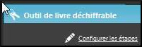

**Introduction**

Ce module nous allons apprendre comment créer un livre déchiffrable dans Bloom (c.-à-d. un livre qui ne contient que les lettres (ou mots à vue) apprises).

**Pourquoi est-ce important ?**

Quand les gens commencent à apprendre à lire, ils ont besoin de beaucoup de pratique avec des documents de lecture qui ne contient que les lettres (ou mots à vue) qu’ils ont apprises jusqu’à présent. Sans un programme comme Bloom, il est très pénible de s’assurer que votre livre est limité aux lettres connues ou mots à vue. Le livre Déchiffrable de Bloom nous permet d’introduire des lettres et des mots à vue à différentes étapes. Lorsque vous faites des livres déchiffrables, Bloom vous avertira chaque fois que vous utilisez un mot avec des lettres qui n’ont pas encore été apprises (ou qui n’est pas un mot à vue).

**Que ferez-vous ?**

-   Créez un livre basé sur le modèle de livre déchiffrable.
-   Régler les étapes en ajoutant les graphèmes, la liste de mots et la définition des lettres et des mots à vue pour chacune des étapes.
-   Créer un livre déchiffrable de niveau 1.

### 8.1 Choisir la collection

-   Si nécessaire, démarrez Bloom
-   Vérifiez que la bonne collection est overte.
-   Si nécessaire, cliquez sur **Autres collections**.

    *La boîte de dialogue* **Ouvrir / Créer une collection** *s’affiche*.

-   Sélectionnez la collection désirée.

    *La fenêtre principale réapparaît.*

### 8.2 Créer un livre déchiffrable

-   Dans le volet **Sources pour des nouveaux livres**, sélectionnez le modèle de **Livre déchiffrable**.
-   Cliquez sur **Créer un livre depuis cette source**.

### 8.3 Configurer les étapes

-   Si nécessaire, cliquez sur  (à droite) pour voir le volet d'outils.
-   Dans le volet **Outil du livre déchiffrable**, cliquez sur **Configurer les étapes**.

    

    *La boîte de dialogue s’affiche*. Voir dessous.

### 8.4 Ajouter des graphèmes

-   Cliquez sur l’onglet **Lettres**.
-   Saisissez ou collez les lettres souhaitées dans la zone de texte **Lettres et ensembles de lettres**.

    

### 8.5 Ajouter une liste de mots (des mots suggérés)

-   Cliquez sur l’onglet **Exemples de mots**.
-   Tapez ou collez les mots suggérés dans la zone de texte **1) Tapez les mots ici**.
-   Cliquez sur le lien Dossier de textes types.

    *Une fenêtre Explorer s’ouvre dans le dossier que Bloom utilise pour obtenir des mots suggérés.*

-   Collez votre fichier texte dans ce dossier.
-   Fermez la fenêtre Explorer.

    *Le nom complet du chemin du fichier est affiché dans la zone de texte* **2) Placez les fichiers texte**\*.\*
