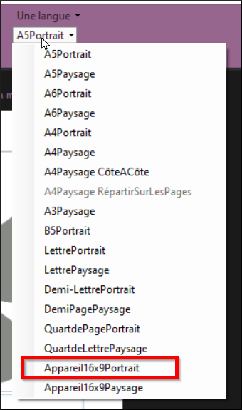
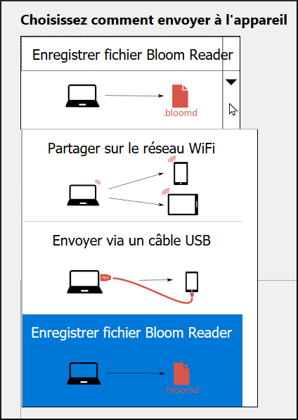

**Introduction**

Bloom peut également créer des livres électroniques qui peuvent être lus sur un Smartphone Android en utilisant l'app Bloom Reader. Ce module explique comment formater votre livre pour un Android et aussi comment transférer le livre sur le téléphone.

**Où en sommes-nous ?**

Vous avez créé un livre que Avant de pouvoir copier votre livre sur votre appareil Android, vous devez télécharger et installer Bloom Reader sur votre téléphone.

**Pourquoi est-ce important ?**

Les livres électroniques sont moins chers à produire, cependant, vous devez avoir une application qui peut les lire. Bloom Reader a été écrit spécialement pour lire les livres Bloom sur un Smartphone Android. Comme la taille de l'écran est très différente de la taille du papier, vous devez d'abord le formater avant de pouvoir l'envoyer à votre téléphone.

**Que ferez-vous ?**

-   D'abord vous devez télécharger et installer Bloom Reader à partir de la boutique Google Playstore.
-   Vous ouvrez ensuite votre livre et le reformatez pour qu'il s'adapte à un écran Android
-   Puis, vous publiez le livre sur votre appareil Android.

### 9.1 Choisir la collection

-   Lancez Bloom (et Bloom Reader sur votre téléphone)
-   Vérifiez que la bonne collection est ouverte.
-   Sinon, cliquez sur **Autres collections**.

    *La boîte de dialogue* **Ouvrir / Créer une collection** *s’affiche.*

-   Sélectionnez la collection désirée.

    *La fenêtre principale réapparaît*.

-   Sélectionnez le livre désirée.

### 9.2 Reformater votre livre pour Android

Vous devez changer la taille de la page et vérifier chaque page pour vous assurer qu'elle s'affiche correctement à l'écran.

**Changer la taille de la page**

-   Dans la barre d'outils, cliquez sur **la taille de la page actuelle** (par exemple, A5Portrait)
-   Choisissez **Appareil16x0Portrait**

    

    *La taille de la page change et Bloom tente de réorganiser la page*.

**Vérifier chaque page**

-   Vérifiez chaque page pour vous assurer qu'elle s'affiche correctement à l'écran. Si ce n'est pas le cas, apportez les modifications nécessaires aux pages problématiques.

### 9.3 Publier votre livre à Android

Pour publier votre livre sur votre Android, vous devez connecter votre appareil, faire quelques réglages et ensuite envoyer le livre. Voir ci-dessous pour les instructions sur la façon de procéder.

**Connecter votre appareil Android**

-   Connectez votre appareil Android à votre PC via le câble ou le Wi-Fi.
-   Vérifiez que le lecteur Bloom est en marche sur votre appareil Android.

**Publier**

-   Cliquer sur l'icône **Publier**
-   Choisissez Android

    

-   Si vous le souhaitez, sélectionnez la couleur dans **Settings** (Couleur des vignettes)

    

-   Sélectionnez votre choix parmi les choix de méthodes

    

**Bloom Reader**

Une fois l'envoi terminé. Sur votre Android, jouez le livre envoyé. Parfois, tout le texte ne sera pas affiché sur l'Android. Vous pouvez avoir besoin de faire quelques ajustements dans le livre Bloom pour que tout le texte s'adapte, puis le publier à nouveau.

