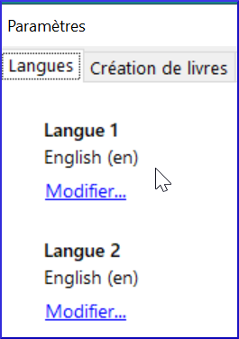

**Introduction**  
In this module, we will learn how to create a shell book (in French) that others can use to create books in their own languages.

**Where are we now?**  
You have already made books in a vernacular collection. Now we are going to learn how to make books in a source collection. We can share these books with others to make them in their languages.

**Why is this important?**  
In Bloom, there are two types of collections. A vernacular collection contains books for a specific language. A source collection contains books in a language like French. Then books that can be shared and translated into vernacular languages.

When you want to create a book that others can translate into their own language, you have to create them in a source collection so that they can be shared with a Bloom pack.

**What will you do?**
- First we will create a new source collection and then create a shell book.
- Then we will make a Bloom pack for this collection that can be sent to others to create books in their language.

## 5.1 Creating a source collection

- 1\. If necessary, launch Bloom
- 2\. Click on the  button **Other collection**.
- 3\. Click on **Create a new collection**.
- 4\. Click **Source Collection**.
- 5\. Click on **Next**.
- 6\. Enter the name of the project (e.g. My Shell Books) and click **Next**.
- 7\. Click **Finish**.

**Change languages**

By default, Bloom sets Language 1 and Language 2 to English. You need to change the languages to French.

- From the main window (i.e. Collections):
- Click on **Settings**.
- Click on the **Languages** tab

    

- To change Language 1 to FR
- Click on the blue **Change** link

    

- Type space then en
- Choose the language French
- Click on **OK**
- repeat for the second language (Language 2 \> FR)

## 5.2 Creating a shell book

**Check the layout pack**

If you are creating A6 books, you can choose "Economy mode for paper".

- From the main window:
- Click on **Settings**.
- Click on the **Book Creation** tab
- Set the layout pack around the cover to **Paper saver**.
- Click **OK**.

**Create a book**

You create source books in the same way as before.

- Click on a template such as **Basic Book**.
- Click **Create a book from this source**.

## 5.3 Complete the book as desired

Fill in
- the cover
- the title page
- Add the pages
- Add text
- Change the images
- Fill in the credits page.

## 5.4 Bloom Pack

You use Bloom packs to share books from the source collections with other users. Before you can use a book in a Bloom pack, you must create and install it.

**Creating a Bloom Pack**

- Click the **Collections** tab.
- On the toolbar, click **Make Bloom Pack**.

    

- Type a name for the Bloom pack file and click **Save**.

    *The Bloom pack is created and ready for distribution*.

- Close Bloom

**Installing a Bloom pack**

Before you can use a Bloom pack, you must install it. 
:::tip
Normally you would copy and paste it to another computer. For now we will install it on your computer to test it.
:::

- Open a **File Explorer** window in the folder.
- Double click on the Bloom pack file.  
    *Bloom will add the collection and display a message when it is finished*.

- Click **OK** to close the message.  
    *Bloom will restart*.

**Use the shell books in a Bloom pack**

- In the **Source for New Books** pane, scroll down and select the desired book.
- Select **Create a book from this source**.  
    *The book is created and each text box shows the text to be translated in a yellow bubble*.

    

- Click on the text box
- Translate the text displayed in the balloon into your language and type it into the text box.

