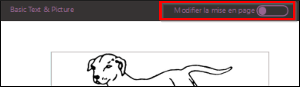

**Introduction**  
This module explains how to create a custom page in a book.

Watch the video **Bloom_custompage-SD.mp4**.

## 6.1 Starting Bloom

- The main window appears.

## 6.2 Choose a collection

- Make sure the correct collection is open.
- If not, click on **Other collections**.

    *The Open/Create Collection dialog box* appears.

- Select the desired collection.

    *The main window reappears*.

## 6.3 Creating a Book

- In the **Sources for New Books** pane, click **Single Book**.
- Click on **Create a book from this source**.
- On the **Outer Cover** page, enter a title

##  6.4 Customizing a Page - Changing Field Size

- You can change the size of text and image fields **by dragging the dividing line** between them.

    

## 6.5 Customizing a Page - Adding Fields

- Right click on the **Edit Layout** button.

    

- Use the **+** symbols to add new fields.

    

- Tell Bloom whether you want to have an image or text in this field.

    

- Click on the Edit Layout button on the left.

    

## 6.6 Creating a Custom Page

- To create a custom page, click **Add Page**,
- Select **Customize**,
- Then click **Add this page**.

    *A custom page is displayed and is ready to be edited*.

## 6.7 Define Page

- Use the **+** symbols to add new fields.
- Click **X** to remove fields.
- Tell Bloom if you want a picture or text in this field.
- Click on the **Edit Layout** button on the left to set the layout

