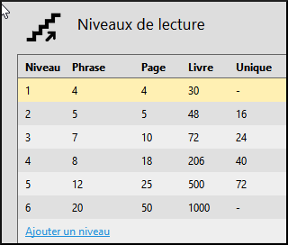
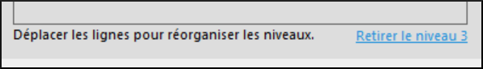
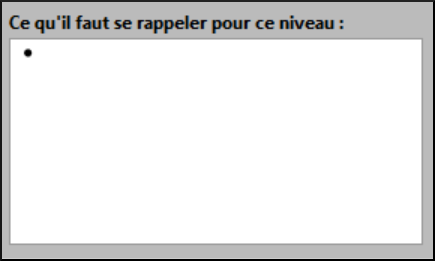

**Introduction**   
This module explains how to create books by level of difficulty in Bloom.

**Why is this important?**
In the next session, we will create decipherable books to help beginners read while they are still learning the letters. With level books, there are no restrictions on the letters used, but it is the difficulty of the books that is controlled. The level of difficulty is defined by the number of pages, the length of the sentences and the number of words per sentence or per page.

**What will you do?**   

- Create a single book or a book by level.
- Set up the levels.
- Create books at different levels.

## 7.1 Choose the collection

- If necessary, click on **Other collections**.

    *The **Open / Create Collection** dialog box is displayed.

- Select the desired collection.

    *The main window reappears.

## 7.2 Creating a Book

- In the **Sources for New Books** pane, select the **Book by Level** template.
- Click **Create a book from this source**.
- If necessary, click the menu icon (right)

    *The "Book by Level Tool" pane is displayed.

## 7.3 Configuring Levels

- In the **Graded Book Tool** pane, click the **Configure Levels** link.

    

    *The "Configure Book Tool by Level" dialog box is displayed.

- On the left side, a level summary table is given. On the right side we can see the rules for a given level.

    

## 7.4 Setting up Level 1

Now we want to define each level according to our rules. Note that there are six previously defined levels. We want to modify these and add additional levels if necessary.

- 1\. Click on **Level 1**.
- 2\. Define the **maximum words in each sentence** (for example, 3).
- 3\. Set the word **maximum in each page** (e.g., 3).
- 4\. Define the **maximum number of words per book** (e.g. 20).
- 5\. If you wish, we could set the **maximum number of unique words per book** (e.g. 10).

## 7.5 Configure other levels

- Configure the other levels as desired.
- Here are some suggestions in the table:
- Set the word limit per sentence. [A]
- Set the word limit per page. [B]
- Set the maximum number of words per book. [C]
- If desired, the limit of single words per book can be set. [D]

| **[A]** | **[B]** | **[C]** | **[D]** |
|------------|---------|---------|---------|---------|
| **2** | **5** | **5** | **48** | **16** |
| 3 | 7 | 10 | 72 | 24 |
| 4 | 8 | 18 | 206 | 40 |
| 5 | 12 | 25 | 500 | 72 |
| 6 | 20 | 50 | 1000 | |
| 6 | 20 | 50 | 1000 | |

## 7.6 Delete a level

- 1\. Click on the level
- 2\. Click on the **Remove Level** link.

    

## 7.7 Changing the Order** (see below)

- Drag lines to change the order.

## 7.8 Add Level Click on the **Add Level** link.

- Click on the **Add Level** link.

    

    If you do not want a rule to apply to a given level, uncheck the appropriate box.

    

## 7.9 Adding Notes to the Author

- We can put notes to the author in the text box **What to remember for this level**.

    

## 7.10 Creating the book

After defining all the levels, we are ready to create our graded book.

- If necessary, click **OK** (to close the dialog box).
- Make sure the level is correct (click on the arrow if necessary)

    

- Fill in the details of the front pages (title page, etc.) and add pages if necessary.
- Type (or copy) text.
- If your text is more complex than allowed for the level, the text or page will change colour.
- Change the font if necessary (see page [3.3.1](#sFormatText))

