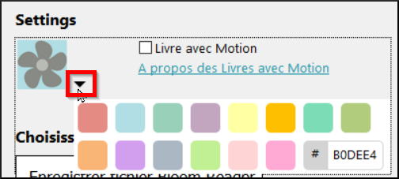

**Introduction**  
Bloom can also create eBooks that can be read on an Android smartphone using the Bloom Reader app. This module explains how to format your book for Android and also how to transfer the book to the phone.

**Where are we now?**  
You have created a book that you want to copy to your Android device. To do this you need to download and install Bloom Reader on your phone.

**Why is this important?**  
E-books are cheaper to produce, however, you need an application that can read them. Bloom Reader was written specifically to read Bloom books on an Android smartphone. As the screen size is very different from the paper size, you must format it first before you can send it to your phone.

**What will you do?**  
- First you need to download and install Bloom Reader from the Google Playstore.
- Then you open your book and reformat it to fit an Android screen
- Then you publish the book to your Android device.

## 9.1 Choosing the collection

- Launch Bloom on your computer (and Bloom Reader on your phone)
- Check that the correct collection is open.  
    - If not, click on **Other collections**.

    *The Open / Create Collection dialog box* will appear.

- Select the desired collection.

    *The main window is displayed*.

- Select the desired book.

## 9.2 Reformatting your book for Android

You need to change the page size and check each page to make sure it is displayed correctly on the screen.

**Change the page size**

- On the toolbar, click **current page size** (for example, A5Portrait)
- Choose **Device16x0Portrait**.

    

    *The size of the page changes and Bloom tries to rearrange the page*.

**Check each page**

- Work through your book and check each page to ensure that it is displayed correctly on the screen. 

If it does not, make the necessary changes to the problem pages.

## 9.3 Publishing your book to Android

To publish your book to your Android, you need to connect your device (phone or tablet), make some settings and then send the book. See below for instructions on how to do this.

**Connecting your Android device**

- Connect your Android device to your PC via cable or Wi-Fi.
- Make sure the Bloom reader is running on your Android device.

## Publish

- Click on the **Publish** icon
- Choose **Android**

    

- If you wish, select the colour in **Settings** (Thumbnail picture colour)

    

- Select your choice from the method choices

    

## Bloom Reader

Once the upload is complete, on your Android, play the sent book. 

:::tip
Sometimes the text will not all be displayed on the Android. You may need to make some adjustments in the Bloom book to fit all the text, then publish/upload it again.
:::

